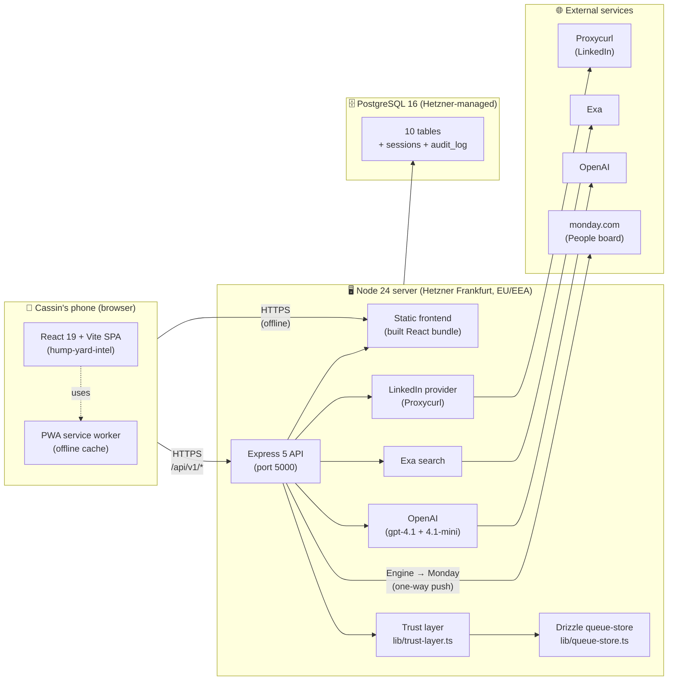
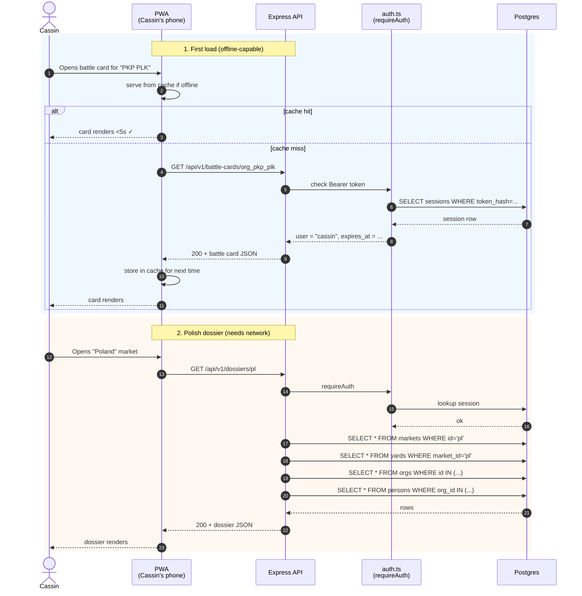
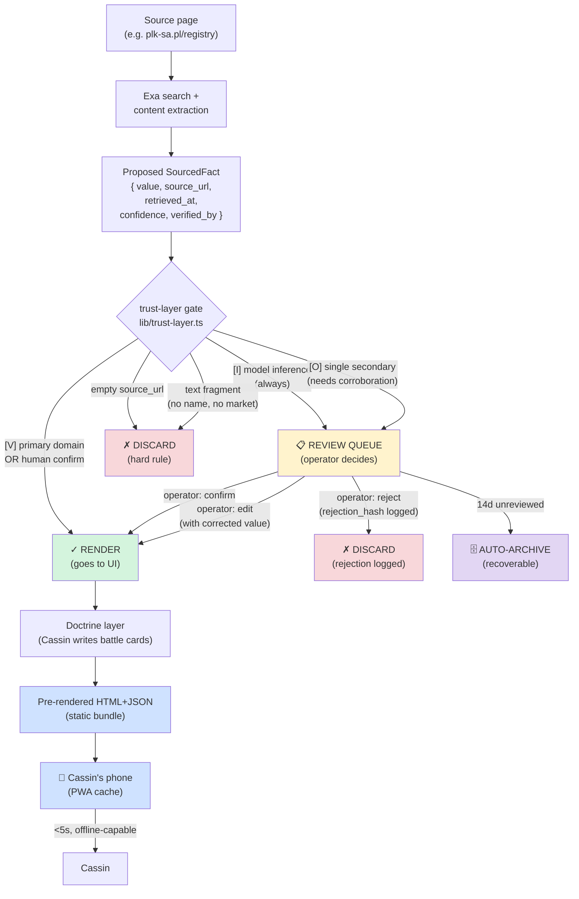
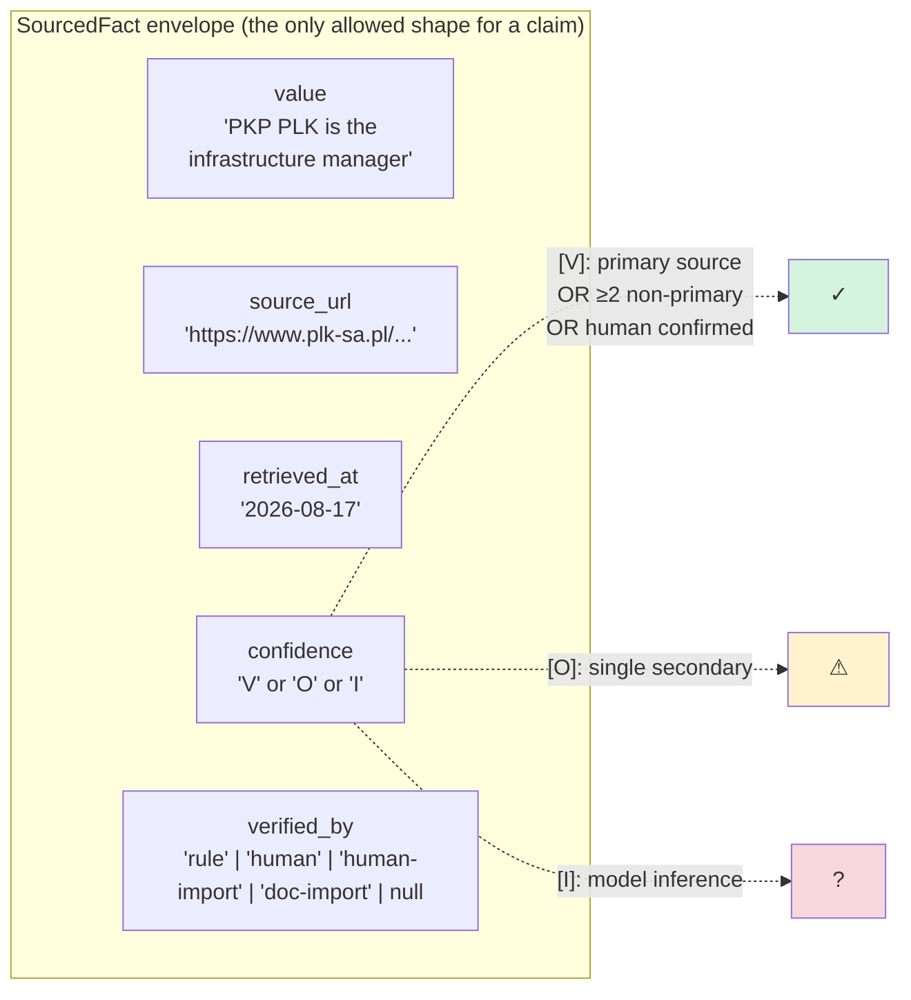
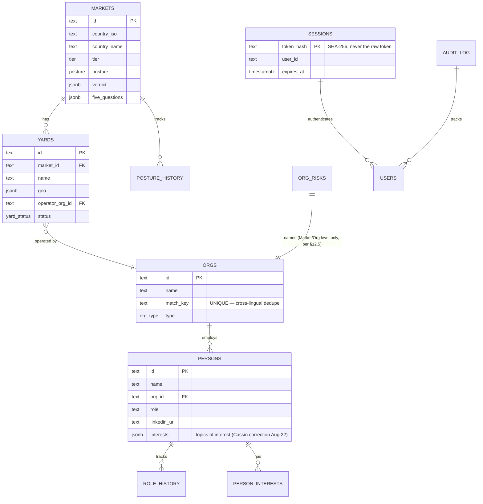
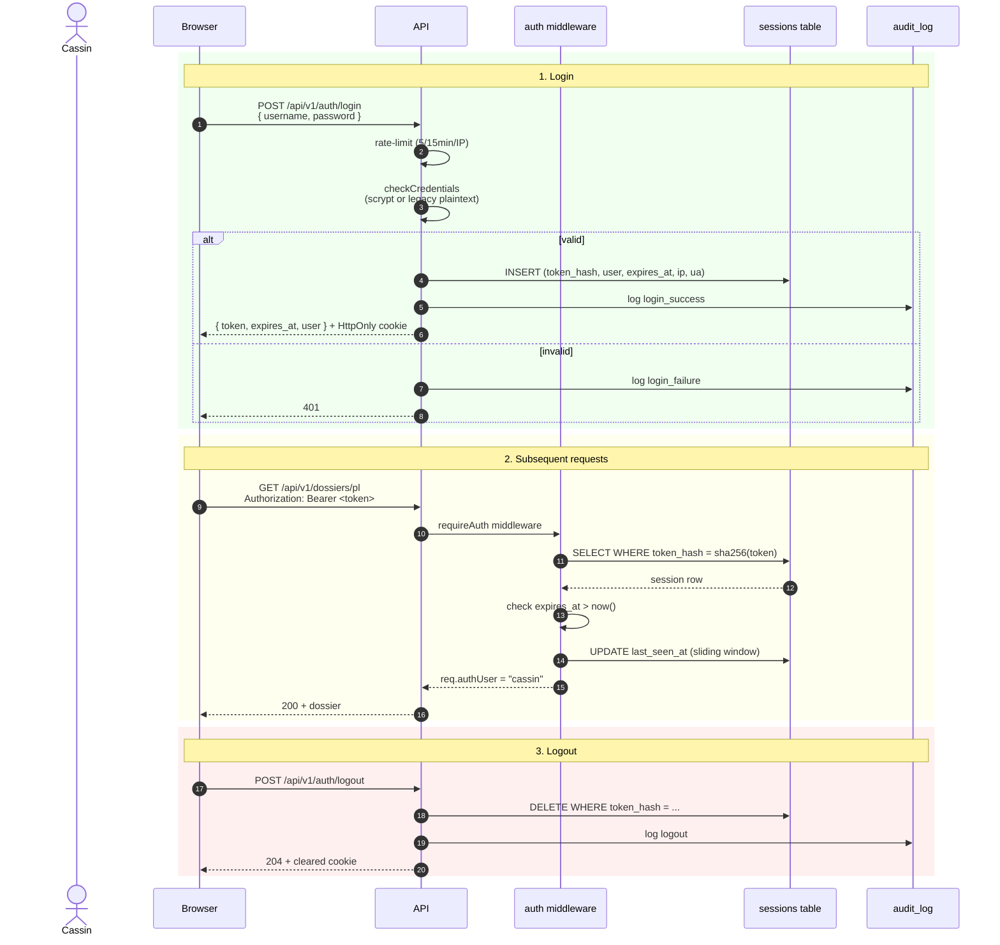
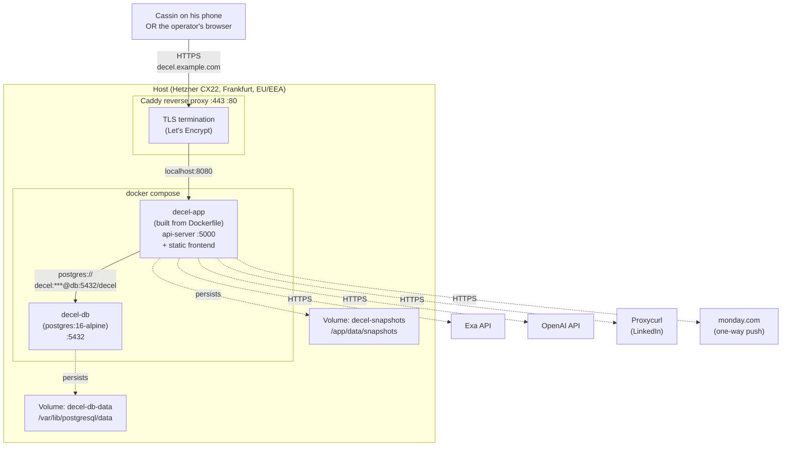
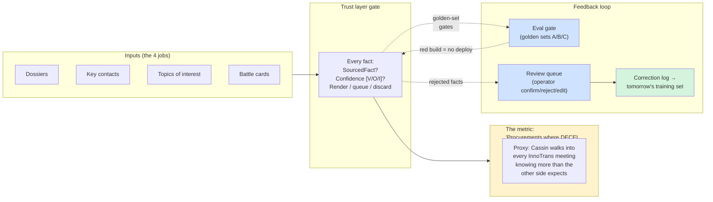
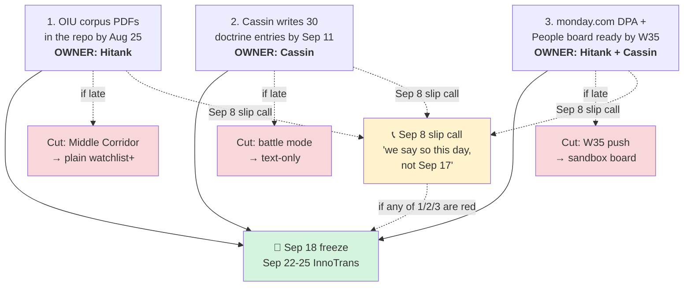

# Architecture — end-to-end trace

> **Read this if you're new.** It's the one-page map of the whole system.
> Every other doc (`API.md`, `DATABASE.md`, `ENV.md`) is a deep-dive into
> one of the boxes below.

---

## 1. The whole system, in one picture



**One-liner:** the API serves both the React frontend and the data API. Trust layer gates every fact. Postgres stores everything. Three external services do search / LLM / LinkedIn enrichment. monday is one-way push.

---

## 2. What happens when Cassin opens the app



**Key observation:** battle cards are pre-rendered JSON, cached on the device. They work in airplane mode. The dossier system needs the network but is fast (<5s with a warm cache).

---

## 3. The trust gate — every fact, every time



**Hard rule:** a fact with no resolvable source cannot render. Ever. This is enforced in `lib/trust-layer.ts:gateSourcedFact` and tested by the eval gate (21/21 green).

---

## 4. The SourcedFact envelope — every claim, every time



**Confidence rules** (mechanical, §11.3):
- **[V]** verified → render
- **[O]** observed (single secondary) → queue (needs corroboration)
- **[I]** inferred (model) → queue (never auto-`[V]`)

---

## 5. The data model — what lives where



See `docs/DATABASE.md` for the full column-by-column spec.

---

## 6. The auth flow — how a session actually works



**Three auth modes, in priority order:**
1. **Bearer token** (`Authorization: Bearer <token>`) — preferred
2. **HttpOnly cookie** (`decel_session`) — set on login, browser flows
3. **HTTP Basic** (`Authorization: Basic <b64>`) — backward compat, curl-friendly

`DISABLE_AUTH=true` short-circuits everything (dev only).

---

## 7. The deployment — what runs where



**Run it:**
```bash
cp .env.example .env
# fill in DATABASE_URL, EXA_API_KEY, OPENAI_API_KEY, AUTH_PASS_HASH, ...
docker compose up
# open http://localhost:8080
```

---

## 8. The metric loop — how we know it's working



**Eval gate (21/21 green right now):** China junk corpus → 0 entities render. Confidence rules enforced. No-resolvable-source → discard. Runs on every push to main; red = no deploy (§11.12).

---

## 9. The 3 things that decide if we ship by Sep 18



---

## 10. Where to look next

| You want to... | Read |
|---|---|
| Understand the API surface | `docs/API.md` |
| Understand the database | `docs/DATABASE.md` |
| Set up env vars | `docs/ENV.md` |
| Understand the 8 contract gaps + sign-offs | `docs/DECISIONS.md` |
| See the sprint plan | `docs/SPRINT.md` |
| Understand the trust gate in code | `artifacts/api-server/src/lib/trust-layer.ts` |
| Understand the data shape | `lib/api-zod/src/manual/schemas.ts` |
| Understand the schema | `lib/db/src/schema/` |
| Run the eval gate | `scripts/eval-gate.ts` |
| Generate a password hash | `pnpm --filter @workspace/api-server run hash-password "your-plain-password"` |
| Bootstrap from scratch | `scripts/setup.ps1` (Windows) or `scripts/setup.sh` (bash) |

---

**ASCII version for terminals that don't render Mermaid:**

```
┌──────────────┐   HTTPS    ┌──────────────────────────────────────────────┐
│  Cassin's    │ ─────────► │ Express 5 API (port 5000)                   │
│  phone       │            │ ├─ helmet security headers                  │
│  (PWA cache) │ ◄───────── │ ├─ requireAuth (token / cookie / basic)    │
└──────────────┘   static    │ ├─ /api/v1/auth/{login,logout,me,...}       │
                               │ ├─ /api/v1/dossiers/*                       │
                               │ ├─ /api/v1/review-queue/*                   │
                               │ ├─ /api/v1/battle-cards/*                   │
                               │ ├─ /api/v1/monday/push/person/:id           │
                               │ ├─ /api/v1/people/:id/enrich                │
                               │ ├─ trust-layer gate (every fact)            │
                               │ └─ queue-store (Drizzle)                     │
                               │     ↓                     ↓                 │
                               │ Postgres 16        Exa · OpenAI · Proxycurl │
                               │ (10 + sessions      (HTTPS, all EU/EEA)  │
                               │  + audit tables)                            │
                               └──────────────────────────────────────────────┘

Trust gate: SourcedFact → { render | queue | discard }
  V  primary source / human confirm     → render
  O  single secondary source            → queue (needs corroboration)
  I  model inference                    → queue (never auto-V)
  no source                            → DISCARD (hard rule)
```
